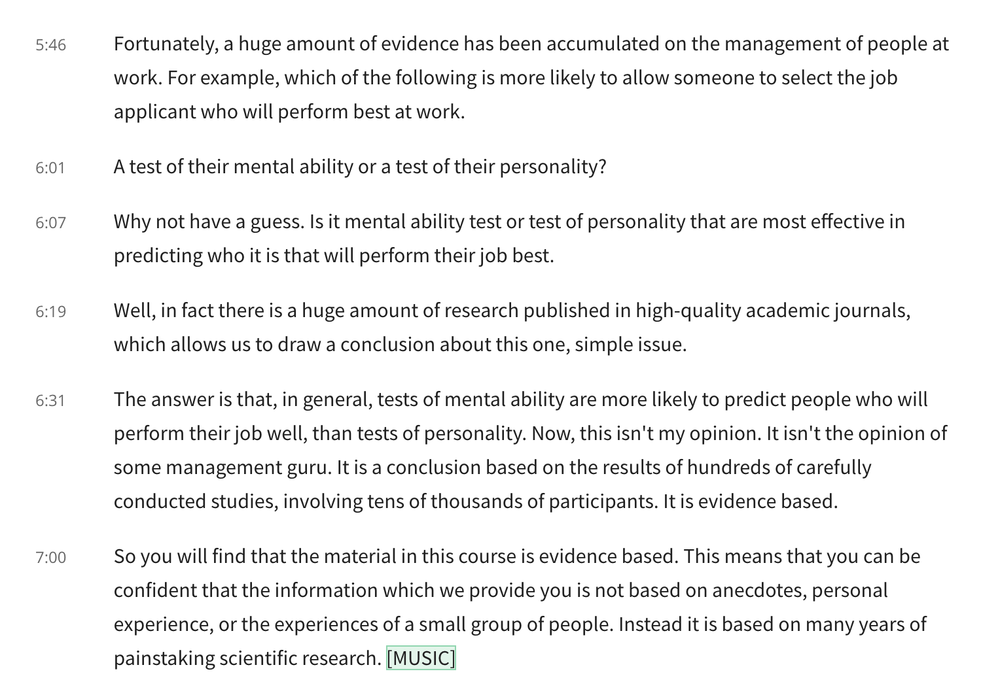

# The Manager's Toolkit: A Practical Guide to Managing People at Work —— (1)

## Introduction

Management is everywhere.

In fact, in virtually any situation in which two or more people need to coordinate and organize their activities, some form of management can be found.

If you look in a bookshop or browse online, you will find many books on management. Generally, they're written about people with first hand experience of managing people, and each book tries to distill a set of ideas, opinions, and beliefs about effective people management.

The ideas tend not to be based on scientific evidence.

The disadvantage of such new approach to educating people about management is that we simply don't know whether the ideas expressed by the authors are sound and helpful. That they will lead to the positive outcomes that the authors say thay will. 

Instead we have to take the author's word for it. We have to assume that the author is right. Even though it represents no evidence or no more than a little anecdotal evidence that what they have to offer would actually work, be effective, lead to the successful management of people at work.

The course takes a quite different approach.

If you want to know what works when it comes to managing people, it's best to base your ideas on evidence. **[Evidence based]**

**The example of evidence-baed management.**

A test of their mental ability or a test of their personality?

> Mental ability has many different definitions, including the power to learn or retain knowledge, the ability to understand the facts and significance of your behavior, possession of the qualities (capacity, ability, power) required to get something done.

The answer is that tests of mental ability are more likely to predict people who will perform their join well, than tests of their personality. It's a conclusion based on the results of hundreds of carefully conducted studies, involving tens of thoudsands of participants. It is evidence based.

A good feel for some of the important things that managers are required to do.

* Employee motivation

  the more people are paid the more motivated to perform their jobs we might expect them to be.

* Staff selection

  Be able to identify people who are going to perform their jobs well 

  the most widely used selection method of all is the **interview**.

  The topic will explain the characteristics of the types of interviews which many years of careful scientific research has shown to be the most effective.

* Resolve conflict

  Some conflict can be effectively managed, contained, and dealt with, or it can escalate, get out of hand, have a strong negative impact on large numbers of people and lead to poor performance.

  The topic will briefly explaining what you can expect to see, hear and do.

## Interviews

The topic will be focusing on the role of the interview, how to conduct a good interview as well as looking at options to the interview and discussing whether it is the best method of selecting new members of staff.

### The Interview and what we want from it.

If you've applied for a job, you have almost certainly had a job interview. Studies in the U.S.A., U,K, France, and elsewhere, have consistently found that interviews are used in well over 90% of job selection procedures.

:star:There is a very good chance that at some point in your life you will be conducting interviews yourselves.

Because we take the interviews so much for granted, we can also easily avoid thinking about them critically, and seeking the answer to some basic questions such as, what is a job interview? What different forms can job interviews take? How could a job interviews as a method of selecting employee? How can an employer improves the interview? How can interviewees improves their chances of success by applying the finding of research.

In this introductory session, we will give you a brief overview of these issues before looking at them in some more detail in the sensings that follow.

**What is an interview?** This may seem too obvious a question but obvious questions can make us reflect on what we have taken for granted and consider implications we may not have thought about.

* An interview is a social interaction between an interviewee and interviewer or interviewers. A conversation between people.
* The interviewer is seeking to discover whether the interviewee would make productive employee.
* The outcome of the interview will be that the interviewee will or will not be offered the job.
* A interview is a two way process of selection. The interviewee may or may not choose to accept the offer.

**What different forms can job interviews take?** 

* Panel interview, which involves a single interviewer or more than one interviewer.
* Unstructured or structured, which involves free flowing conversations that can vary between candidates or must adhere to throughout the selection process.
* Tranditional case or media

**How could a job interviews as a method of selecting employee?**

* Selection methods such as interviews, cognitive ability tests, personality measures, assessment centers, and so on, 

  need to be judged in terms of a number of criteria including validity, that is predictive power; 

  reliability, that is consistency; 

  utility, or cost effectiveness, 

  fairness, an equal chance to all applicants, 

  and generalized ability, the extent to which you can be used in a wide range of situations.

* Be fair in the sense of not discriminating against particular groups of applicants, gender groups, ethnic groups, etc.

**How can an employer improves the interview?**

* Adopt the from of interview which most strongly demonstrated desirable characteristics, such as validity, fairness, and so on.

### The structured interview

The basic characteristics of structured interviews are simply Candidates are all asked the same questions in the same order. **So their responses can be readily compared**.

**So structured interviews do need careful preparation and some expertise.**

* **Be careful analysis of the job in question.** This can involve observing existing job holders doing the same job, talking to superivisors and other experts.
* **Careful examination of the job description.**
* This job analysis should **be used as the basis** for creation of strictly job related questions and the criteria for assessing their response.
* Follow on or supplementary questions **should be strictly limited and focused on** objective knowledge skills and abilities.
* The balance sheet for structured interview is **having high predictive power**, like cognitive ability tests and work samples. By using an objective assessment method, the risk of bias of seriously reduced.
* **bad:** expensive in time and resources

### The unstructured interview

Also called the traditional interview.

**What are the characteristics of an unstructured or traditional interview?**

* Unstructured. no set format, no set order
* Cheap and easy to set up.
* The biases, stereotypes and prejudices.. It's entirely subjective.

### Alternative to Interviews: tests and assessment centresT

To make an informed evidence based decision whether or not to use structured interviews or any other selection method. It is neccessary to make a comparison with available alternative.

A very wide range of selection methods are used around the world. Eg: A candidate applying for a job in France will routinely be asked to make the application in his or her own handwriting.

The topic limits the comparisons to just three methods with proven good or high preictive validity.

Cognitive ability tests, work sample tests and assessment centers.

**Cognitive ability or intelligence tests. **Cognitive ability tests are also fairly cheap and you don't need different tests for different jobs. The same test will do just fine across a wide range of jobs. So high predictive power, a wide range of applications, and relatively low cost. There are some serious positives for cognitive ability tests. 

Cognitive ability tests are discriminatory. Individuals from certain ethnic or other groups score less well on standard CATs. And for those groups, the test score underestimates their actual job performance.

**Work Sample Test.** A Work Sample Test involves as the name suggests, doing a sample as the work required for the job. From the candidate's point of view, too, they have the advantage of making it clear what the job will actually involve.

But they are often expensive. A realistic reproduction of the work task may involve material, equipment and so on.

**Assessment centers.**  They are not a place, but a method. The method involves bringing candidates together in small groups of five to ten and putting them through a series of tests including interviews and work samples, leaderless discussion groups, and so on. So they're extremely thorough and allow the assessors to get a very detailed look at the candidate and his or her strengths and weaknesses.

However the fact is the overall assessment centers have less predictive power than some of the components of the assessment center. In particular work samples, cognitive ability tests or structured interviews. So if you want higher prediction at lower cost, go for one of those.

### Panels, Boards, Telephone and Virtual Interviews

There are other distinctions and differences between interviews we should think about.

**Single interview or Panel interview.**

The distinction between single interviewer and panel interviewers comes across structured, unstructured distinction. Both structured and unstructured interviewers can be panal or single interviewer.

Individual interview will almost inevitably be less expensive than a panel interview, so a single interview is the obvious way to go.

But many organizations prefer to use a panel interview may often be as much of an natural internal politics as anything else, where certain individuals wanting own, import and control over the selection or the promotions process. But there is no serious evidence that this leads to better decisions.

**Virtual interview.**

The most common use of telephone interviews has been to narrow down the applicant pool to a more manageable number of suitable candidates who can be called in for a second face to face interview.

**Telephone interviews** to use for this purpose tend to be structured, with the interviewer working through a list of questions and scoring the candidate's answers as the interview progresses.

In the last couple of decades, the telephone interview has been joined by the **webcam interview** as a medium for conducting interviews at a distance. 

In terms of utility, they have much the same advantage of telephone interviews, though at the same time providing some visual clues.

Whether these visual clues lead to better decisions is a matter research has not entirely been able to resolve. Research by sears comparing webcam and face to face interviews found that applicants in webcam interviews received lower ratings than those in face to face. But this leaves open the question as to which was actually the most accurate rating.
