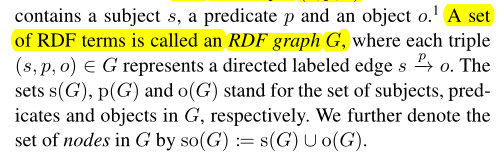
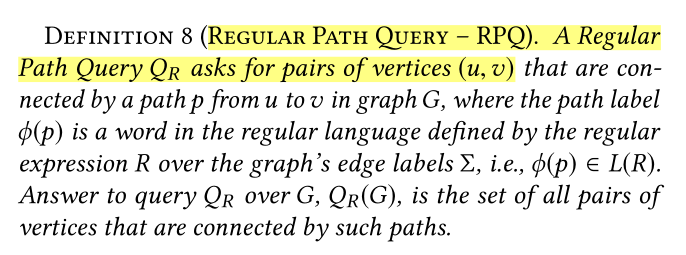

# 正则路径&正则表达式&克林闭包

属性路径查询是sparql1.1的新特性，sparql为查找RDF图数据服务。

因此，SPARQL查询是基于RDF数据模型的，所以先搞清楚什么是RDF图。

## RDF图

RDF是一个有向、带标签的**图数据格式**，用来表示web上的信息。(RDF data model RDF数据模型)

**RDF**：RDF数据模型使用三个不相交的成对集合的RDF术语组成：I：标识资源的国际化资源标识符（IRIs）集合， L：标识字符串和数据类型值的文字集合， B：空白节点集，由空白节点标识的资源也称为匿名资源。RDF三元组$(s, p, o) \in IB \times I \times IBL$ 包含 subject s，predicate p 和 object o。

> **空白节点**只能用作RDF三元组的subject或者object，只是简单得指示事物的存在，而无需用URI标识任何指特定的事物。空白节点可以作为一个临时节点，或者说作为一个容器，可以代表复杂的属性（比如：由街道、电话号、邮政编码等组成的地址），可以保护内部信息（eg：保护客户的敏感信息不受浏览器侵害）

 

**RDF GRAPH**：

①RDF图 $T=(V, E, \Sigma)$，其中$V, E, \Sigma$分别表示G中的顶点、边、边标签的集合。其中，$V = \{ s | (s, p, o) \in G\}  \cup \{ o | (s, p, o)\in G\}$，$ E = \{ (s, o) | (s, p , o) \in G \}$ ，$\Sigma = \{ p | (s, p, o) \in G\}$


②RDF三元组的集合我们可以称之为RDF图。其中每个三元组$(s, p, o)\in G$ 表示有向的、带标记的边 $s\stackrel{p}{\longrightarrow}o$。$s(G), p(G), o(G)$ 分别标识 subject，predicate，object 集合。$so(G) := s(G) \cup o(G)$  标识G中的节点集。




## 正则表达式

正则表达式 & 正则语言

字母表$\Sigma$上的正则表达式$R$递归地定义为$R ::= \epsilon \mid a \mid R/R \mid R|R \mid R^*$，其中$\epsilon$表示空字符串，$a\in \Sigma$表示字母表上的字符，$/$表示串联操作符，$\mid$表示alternation（交替，并联）操作符，$*$表示Kleene star操作符。

字母表$\Sigma$：有穷字符集，eg：$\Sigma = \{a, b, c\}$，$\Sigma$上的符号串指的是由$\Sigma$中的符号所构成的有穷序列，符号串的全体：$\Sigma^* = \{\epsilon,a,b,c,aa,ab,ac,ba,bb,...\}$ ，空字也包括在其中。

正则语言 L(R) 是正则表达式R可以描述的所有字符串的集合。

$\phi(p) $是路径$p$的标签。 


$\neg$表示表达式的否定，用$R^+$表示R的一次或多次重复。


## 路径

给定 $u, v \in V$，在图G中从$u$到$v$的路径$p$是一系列边  $u\stackrel{p}{\longrightarrow}v : <(v_0, l_0, v_1), ... (v_{n-1}, l_{n-1}, v_n)>$，其中$v_0 = u, v_n = v$。路径$p$的label表示成  $\phi(p) = l_0l_1...l_{n-1} \in \Sigma^*$ [满足路径p的标签序列]


## 正则路径

属性路径是通过两个图节点之间的可能路径。普通情况下长度为1的属性路径，是三元组模式。

路径的末端可能是RDF项或变量。变量不能作路径本身的一部分，只能用作末端。

**属性路径允许对一些sparql基本图模式进行更简洁的表达，并且增加了通过任意长度 路径匹配两个资源的连接性能力。**

> 这句话前半段，说对一些sparql基本图模式进行更简洁的表达。比如使用 ^ ? 类型的连接符（单目运算符，）
>
> 后半段是，属性路径还支持 任意长度的路径 在图上匹配两个资源连接性的能力。比如使用 / * + 这种类型的连接符（它们可以表示任意长度的路径）

属性路径语法：

iri（international resource identifier）：iri要么是一个完整的IRI，要么是一个前缀名称的缩写。

> IRI是URI的概括并且与URI（Uniform Resource Identifier）和URL完全兼容，可以看作是URI或者URL的泛化和推广，在整个网络中或者图中定义一个实体或者资源，类似身份证号。
>
> 下面不同的方式表示的是同一种IRI
>
> ```
> ① <http://example.org/book/book1>
> 
> ② PREFIX book: <http://example.org/book/>
> book:book1
> 
> eg：
> { :book1 dc:title|rdfs:label ?displayString }
> { :book1 <http://purl.org/dc/elements/1.1/title> | <http://www.w3.org/2000/01/rdf-schema#label> ?displayString }
> ```

elt（路径的组成元素）


任意长度路径匹配 【从查询本质（*）来说：可匹配任意长度的路径，**从这个查询的本身来说的，意思是在图上可以匹配任意长度的路径**】

【（a/b/c）* 长度为3的表达式kleene，这里的长度指代的是查询谓词的数量。这两者本质是不同的。确实需要另一个词来指代kleene闭包查询中谓词的个数（路径元素的集合？）】

```SPARQL
 {
    ?x foaf:mbox <mailto:alice@example> .
    ?x foaf:knows+/foaf:name ?name .
  }
任意长度匹配：通过 foaf:knows 查找 Alice 可以联系到的所有人的姓名：
```


### 任意长度 路径匹配

subject和object之间通过任意长度的属性路径进行连接，

任意长度的属性路径（如何实现），我们可以使用“zero or more”属性路径运算符 * ，“one or more”属性路径运算符“+”，当然还有“zero or one”连接属性运算符？

我的理解：

**属性路径定义中引入了正则表达式** ---> 正则路径

## 正则路径查询

Regular Path Query - RPQ

正则路径查询，

​	查询的结果是成对的顶点$(u, v)$，其中，这些顶点由图G中从u到v的路径p连接。**也就是满足路径的节点对集合。**

​	路径标签$\phi(p)$是正则语言中的一个word，这个word由G中的边标签$\Sigma$上的正则表达式R定义，即$\phi(p) \in L(R)$。

在G上查询$Q_R$，$Q_R(G)$的答案是由这些路径连接的所有顶点对的集合。



当一个路径的标签与R匹配时，则说明路径满足RPQ R。

**形式化定义：**

给定一个图G和一个RPQ R，标准语义下的查询集表示： $R_G = \{(x, y) | \exist a \quad path \quad p \quad in \quad G\quad from \quad x \quad to \quad y \quad , \phi(p) \in L(R)\}$

其中： L(R)是正则表达式R可以描述的所有字符串的集合。$\phi(p) $是路径$p$的标签。

换句话说，在G上满足路径的节点对的集合。


## 克林闭包

kleene *，或称kleene闭包。一元运算。

当kleene 闭包被应用在一个集合V时，写法是$V^*$，被广泛用于正则表达式。

形式化定义：

假定 $V_0 = \{\epsilon\}$ 递归的定义集合 $V_{i + 1} = \{wv: w \in V_i \wedge v \in V\}$，这里$i > 0$

如果$V$是一个形式语言，集合$V$的第i次幂是集合$V$ 同自身i次串接的简写。也就是说，$V_i$可以理解为是从$V$中的符号形成的所有长度为i的字符串的集合。

所以在V上kleene闭包定义为$V^* = \bigcup \limits_{i = 0}^{+\infty}V_i=\{\epsilon\} \cup V \cup V^2 \cup V^3 \cup .. $

就是说，他是从V中的符号生成的所有可能的有限长度的字符串的搜集（集合）。


## 克林闭包正则路径查询定义                                                                                                                                                                                                                                                                                                                                                                                                                                                                                                                                                                                                                                                                                                                                                                                                                                                                                                                                                                                                                                                                                                                                                                                                                                                                                                                                                                                                                                                                                                                                                                                                                                                                                                                                                                                                                                                                                                                                                                                                                                                                                                                                                                                                                                                                                                                                                                                                                                                                                                                                                                                                                                                                                                                                                                                                                                                                                                                                                                                                                                                                                                                                                                                                                                                                                                                                                                                                                                                                                                                                                                                                                                                                                                                                                                                                                                                                                                                                                                                                                                                                                                                                                                                                                                                                                                                                                                                                                                                                                                                                                                                                                                                                                                                                                                                                                                                                                                                                                                                                                                                                                                                                                                                                                                                                                                                                                                                                                                                                                                                                                                                                                                                                                                                                                                                                                                                                                                                                                                                                                                                                                                                                                                                                                                                                                                                                                                                                                                                                                                                                                                                                                                                                                                                                                                                                                                                                                                                                                                                                                                                                                                                                                                                                                                                                                                                                                                                                                                                                                                                                                                                                                                                                                                                                                                                                                                                                                                                                                                                                                                                                                                                                                                                                                                                                                                                                                                                                                                                                                                                                                                                                                                                                                                                                                                                                                                                                                                                                                                                                                                                                                                                                                                                                                                                                                                                                                                                                                                                                                                                                                                                                                                                                                                                                                                                                                                                                                                                                                                                                                                                                                                                                                                                                                                                                   

给定一个图G和一个RPQ R，标准语义下的查询集表示： $R_G = \{(x, y) | \exist a \quad path \quad p \quad in \quad G\quad from \quad x \quad to \quad y \quad , \phi(p) \in L(R)\}$

其中在G上$\Sigma$的正则表达式$R$递归地定义为$R ::= \epsilon \mid a \mid R/R  \mid R^*$，其中$\epsilon$表示空字符串，$a\in \Sigma$表示字母表上的字符，$/$表示串联操作符，$*$表示Kleene star操作符。

其中： L(R)是正则表达式R可以描述的所有字符串的集合。$\phi(p) $是路径$p$的标签。

单谓词kleene —— $R_1:=a^*$，其中 $a \in \Sigma$        eg：(knows)*

表达式kleene —— $R_2: = (a_i/a_j/a_k)^* \cup (a_i/a_j)^*$，其中$1 <= i, j, k <= SIZE(\Sigma)$      eg：(knows/worksFor)*

~~复杂kleene ——$R ::=  a \mid R_i/R_j  \mid  R_i^*$ ，其中 $ 1 <= i <=2 $	eg：teacherOf/(knows)\*/(knows/worksFor)*、((knows/worksFor)\*)\*~~

复杂kleene ——$R ::=   R_i/R_j  \mid  R_i^*$ ，其中 $ 1 <= i <=2 $	eg：teacherOf/(knows)\*/(knows/worksFor)*、((knows/worksFor)\*)\*

【存疑】


